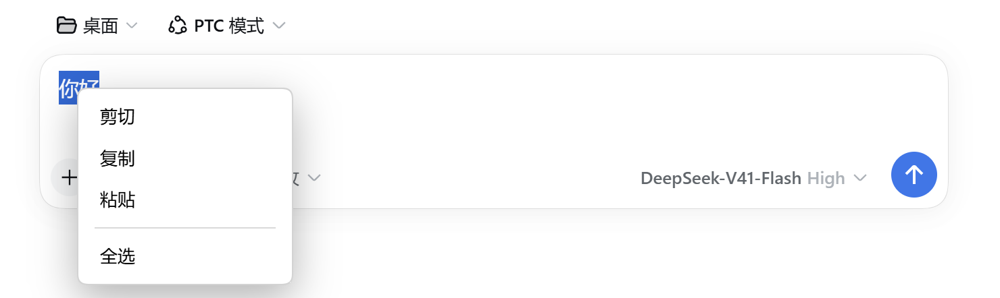

<div align="center">


**给 DeepSeek Harness 的输入框补上缺失的右键菜单**

[简体中文](README.md) | [English](README.en.md)

[](LICENSE)
[](https://github.com/wuwaka/dsh-clipboard-menu/releases)
[](https://github.com/wuwaka/dsh-clipboard-menu/actions/workflows/ci.yml)
[](https://github.com/wuwaka/dsh-clipboard-menu/stargazers)
[](https://github.com/topics/dsh-plugin)
[](#)

</div>

## 这是什么

在 DeepSeek Harness 的**输入框上右键**，弹出一个顺手的菜单：



| 菜单项 | 说明 |
| --- | --- |
| ✂️ 剪切 | 剪切选中的文字 |
| 📋 复制 | 复制选中的文字 |
| 📥 粘贴 | 把系统剪贴板的内容粘到光标处 |
| 🗂️ 全选 | 选中输入框全部内容 |
| 🌐 搜索 | 用默认浏览器搜索选中的文字，右侧标出当前引擎（无选区时置灰） |
| 🌐 搜索引擎… | **鼠标悬浮**即在它正下方展开引擎列表：百度 / Bing / Google / DuckDuckGo / 自定义 |

在 **AI 回复、文档预览、代码块**等只读区域里选中文字后右键，则给出三项：

| 菜单项 | 说明 |
| --- | --- |
| 📋 复制 | 保留格式复制（粘进 Word 等会带样式） |
| 📝 复制为纯文本 | 只复制文字，粘进终端或编辑器更干净 |
| 🌐 搜索 | 用默认浏览器搜索选中的文字 |
| 🌐 搜索引擎… | 切换搜索引擎 |

### 搜索引擎是怎么定的

**网页读不到浏览器的默认搜索引擎**——Web 平台不暴露这个 API（防止网页探测用户画像）。所以按下面的顺序决定：

1. **你选过的那个** —— 鼠标移到「搜索引擎…」上，在展开的列表里点一次，记进 `localStorage`，以后一直用它
2. 没选过就**按界面语言猜**：中文 → **百度**，其他 → Google
3. `window.__DSH_CLIPBOARD_MENU_SEARCH__` 可显式覆盖（开发者用）

列表里的「**自定义**」会展开一个小表单：

| 字段 | 说明 |
| --- | --- |
| **名称** | 显示在列表与「搜索」右侧；不填则用网址的域名 |
| **网址** | 搜索地址，用 §{query}§ 表示关键词；不写则把关键词拼在末尾 |

§§§
https://search.example.org/find?q={query}
§§§

按 **回车** 或点「**保存**」生效。两个输入框里**右键**也会弹出同样的剪切/复制/粘贴/全选菜单（独立浮层，不会冲掉表单），旁边另有「**粘贴**」按钮。**Esc** 只退回上一层，不会把整个菜单关掉。

**浏览器本身不用配。** `window.open` 会经桌面端的 `shell.openExternal` 交给**操作系统的默认浏览器**——你在系统里设过哪个就用哪个。

没选中文字时剪切与复制自动置灰；只读区域若没有选区，插件**完全放行**给应用自己的菜单。菜单文字跟随界面语言（中文 / English），配色跟随系统明暗主题。

## 为什么需要它

**Electron 本身不提供右键菜单**，而 DSH Desktop 的外壳也没有补上，所以桌面窗口里右键输入框**什么都不弹**——只能用 `Ctrl+C` / `Ctrl+V`。

桌面主进程是打包好的 bundle（`lib/main.js` + `electron-runtime`），插件无法注入去挂 `webContents` 事件，所以这个插件把菜单做在**渲染进程**里。

## 🚀 安装

```sh
dsh plugin --profile <profile> add github:wuwaka/dsh-clipboard-menu
```

本地开发：

```sh
dsh plugin --profile <profile> add /path/to/dsh-clipboard-menu
```

装完重启宿主（或承载它的桌面端）即可生效。

## 🔒 生效范围

**只在没有自带右键菜单的外壳里生效。**

普通浏览器标签页本来就有原生菜单，而且比这个更好用（粘贴并匹配样式、搜索、检查元素……），**所以插件在浏览器里完全不安装监听器，右键行为保持原样**，不做降级。

判定依据：

| 信号 | 来源 |
| --- | --- |
| `dsh-desktop-mode` 等 URL 参数 | DSH Desktop 往渲染进程 URL 上打的标记 |
| `window.__DSH_DESKTOP_FILE_PATH__` | DSH Desktop 的 preload 桥 |
| User-Agent 含 `Electron/` | 其他 Electron 外壳 |
| `__TAURI__` / `__TAURI_INTERNALS__` | Tauri 外壳 |

以上都不满足（即普通浏览器）→ 不生效。想刻意在浏览器里用，可在插件加载前设置：

```js
window.__DSH_CLIPBOARD_MENU_FORCE__ = true
```

## ⚙️ 实现方式

DSH 的输入框是 **Lexical 富文本编辑器**（`contenteditable`），不能简单地给 `value` 赋值，因此粘贴按目标类型分三条路径：

| 目标 | 粘贴实现 |
| --- | --- |
| `contenteditable`（Lexical 编辑器） | 合成一个真实的 `ClipboardEvent('paste')` 带上 `DataTransfer`，交给 Lexical 自己的 paste 监听处理；失败再退回 `execCommand('insertText')` |
| `<input>` / `<textarea>`（React 受控） | 走原生 `value` setter 写值 + 派发 `input` 事件（React 才认） |
| xterm 终端 | 同样派发合成 `paste` 事件 |

剪切 / 复制使用 `document.execCommand('cut' | 'copy')`，执行前先**恢复右键那一刻保存的选区**（contenteditable 用 `Range`，输入框用 `selectionStart/End`）；复制失败时退回 `navigator.clipboard.writeText`。

插件只拦截两类右键：**可编辑字段**（完整四项）与**有选区的只读内容**（仅复制两项）；其余情况一律放行，应用与其他插件自己的右键菜单（JSON 复制按钮、侧边栏预览等）不受影响。

## 🧪 测试

```sh
npm install --no-save jsdom
node test/smoke.cjs
```

覆盖 56 项断言：菜单渲染、无选区时剪贴置灰、textarea 粘贴落点与 `input` 事件、合成 paste 事件抵达 `contenteditable` 监听、只读区域无选区时不拦截、只读选区的复制与复制为纯文本、复制不夺焦点、**滚动不关菜单（但外部点击仍会关）**、搜索项用选中文字打开浏览器、中文界面默认百度而英文默认 Google、悬浮展开引擎列表且不影响主菜单、自定义引擎可命名并在列表中显示、表单内右键弹出剪贴板菜单且不关闭表单、粘贴能把网址填进字段、选择过的引擎会被持久记住、自定义网址模板的 {query} 会被正确替换、每个菜单项各有一个图标、浏览器里不安装监听器、强制开关可反向启用。

## ⚠️ 已知限制

- 若 `navigator.clipboard.readText()` 被拒绝，菜单会提示剪贴板不可用并建议用 `Ctrl+V`
- 没有做「粘贴并匹配样式」

## 📄 许可证

[MIT](LICENSE)
